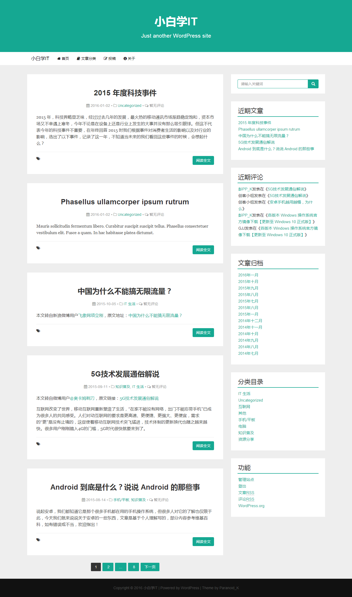

# Paranoid WP

Paranoid WP 是为[小白学IT网站](http://www.xbxit.com)制作的 WordPress 主题，基于 Bootstrap 框架，UI 风格参考了[Ghost中文网](http://www.ghostchina.com)，支持多语言和响应式。

该主题尚未完善，暂不可用于任何站点，也没有 Demo 站点，具体效果看下图：

由于这是本人制作的第一个 WordPress 主题，大部分内容均是边学边写的，关键的地方均写了注释，且几乎所有功能都是使用 WordPress 自带的函数实现，所以可以当作学习制作 WordPress 主题的参考。

## TO DO LIST

* 导航栏
* 搜索页面
* ~~分类页面~~
* ~~归档页面~~
* 404页面
* 评论功能
* 返回顶部功能
* 更多功能
* 细节完善
* 添加多语言包

## BUG

* 主题自定义页面小工具选项无法使用，但可以在外观/小工具页面内设置